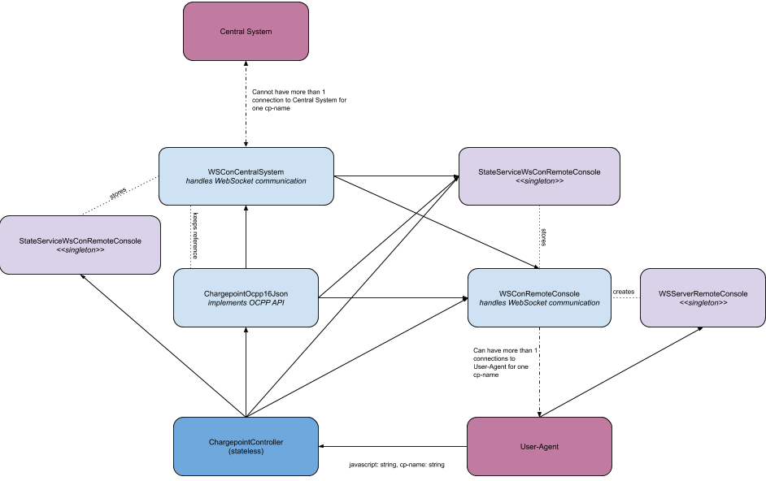

# Scriptable OCPP Chargepoint Simulator


# Intro

This simulator supports:

* OCPP 1.6 (and security) with JSON
* REST API with HTML Frontend
* File based batch mode
* Fully scriptable in JavaScript
* ftp and csr operations
* ws:// and wss:// (with client certificates)

Key development considerations:

* This tool should help you in learning and understanding the [Open Charge Point Protocol (OCPP)](https://www.openchargealliance.org), therefore it doesn't hide any details, but make them easier to grasp
* It's an all [ECMAScript](https://en.wikipedia.org/wiki/ECMAScript) based project
* [NodeJs](https://nodejs.org) based server with server-side [TypeScript](https://www.typescriptlang.org) support
* [Vue](https://vuejs.org) + [Vuex](https://vuex.vuejs.org) + [bulma](https://bulma.io) + [axios](https://github.com/axios/axios) + [vue-axios](https://github.com/imcvampire/vue-axios) based HTML client with super simple [requirejs](https://requirejs.org/) no-transpiler setup 
* TODO: OCPP code should run inside a browser too

# license

This software is licensed under [Apache License, Version 2.0](https://www.apache.org/licenses/LICENSE-2.0). See [LICENSE](LICENSE).

## install & build

Make sure you've npm installed.

## batch operation

Put the logic using JavaScript into a file (e.g. custom.js). Your file needs to export an async function with one
parameter. This parameter will pass the `connect(url: string): Chargepoint` function to obtain a Chargepoint class object.

Example:

```
let cp;
try {
  // WebSocket Connect (no OCPP)
  cp = await connect('ws://localhost:8100/xyz');
  // typical startup OCPP
  await cp.sendBootnotification({chargePointVendor: "vendor", chargePointModel: "1"});
  await cp.sendHeartbeat();
  await cp.sendStatusNotification({connectorId: 0, errorCode: "NoError", status: "Available"});
  await cp.sendStatusNotification({connectorId: 1, errorCode: "NoError", status: "Available"});
  // register code for GetDiagnostics, UpdateFirmware, Reset, ...
  cp.answerGetDiagnostics( async (request) => {
    const fileName = "foo." + new Date().toISOString() + ".txt";
    cp.sendResponse(request.uniqueId, {fileName});
    await cp.sendDiagnosticsStatusNotification({status: "Idle"});
    await cp.sleep(5000);
    await cp.sendDiagnosticsStatusNotification({status: "Uploading"});
    await cp.ftpUploadDummyFile(request.payload.location, fileName);
    await cp.sendDiagnosticsStatusNotification({status: "Uploaded"});
  });
  // Typical charging session
  await cp.sendAuthorize({idTag: "ccc"});
  await cp.sendStatusNotification({connectorId: 1, errorCode: "NoError", status: "Preparing"});
  cp.transaction = await cp.startTransaction({connectorId: 1, idTag: "ccc", meterStart: 1377, timestamp: "2020-06-11T10:50:58.333Z"});
  await cp.sendStatusNotification({connectorId: 1, errorCode: "NoError", status: "Charging"});
  await cp.meterValues({connectorId: 1, transactionId: cp.transaction.transactionId, meterValue: [{ timestamp: "2020-06-11T10:50:58.765Z", sampledValue: [{value: 1387}] }]});
  await cp.stopTransaction({transactionId: cp.transaction.transactionId, meterStop: 1399, timestamp: "2020-06-11T10:50:59.148Z"});
  await cp.sendStatusNotification({connectorId: 1, errorCode: "NoError", status: "Finishing"});
  await cp.sendStatusNotification({connectorId: 1, errorCode: "NoError", status: "Available"});
} catch (err) {
  console.log(err);
} finally {
  cp.close();
}
```

Start it:

```
./start.sh --v ./custom.js
# or
cat custom.js | ./start.sh --v --stdin
```

### Remote manipulation for the batch mode

You can start a web server within the batch operation script to allow the manipulation or observation of the script.

```
const webserver = cp.startListener(8080, '0.0.0.0', {'admin': 'secret'});
webserver.get('/stop', (req, res) => {
    res.send('stopped.');
    webserver.terminate();
});
webserver.get('/availability', (req, res) => {
    // this assumes we're storing the current availability in a variable called 'availability'
    res.send(availability);
});
```

This example starts a web server on 0.0.0.0:8080 using basic authentication. A user 'admin' with the password 'secret' allows under /stop to stop
 the webserver and under /availability to retrieve the charge points availability. 

## server operation

Default port for HTML is 3000. Change via env variable `PORT`. The WebSocket based Server to Client communication is using `PORT+1`.

```
./start.sh --v
```

Open `http://localhost:3000/?connectTemplate=$connectUrl&cp=$chargePointName` where chargePointName defines the ID of your chargepoint and connectUrl the connect string without the chargepoint-id at the end.

Example: `http://localhost:3000/?connectTemplate=ws://foobar:8088/charging&cp=chargepoint001`.

## Create API docs

```
npm run docs
```

Open the docs in ./public/docs or access them via `./start.sh` and [http://localhost:3000/docs](http://localhost:3000/docs)

## TLS options

To pass a root CA file (to verify the server's certificate) use the --ca parameter from start.sh or set the env variable SSL_CERT_FILE.

To set client certificates (for mTLS) for a charge point with the id `my-chargepoint-id` use the following parameters:

```
./start.sh --v1 --keyStore '[{"id": "my-chargepoint-id", "key": "private.pem", "cert": "cert.pem"}]' --ca ./ca.pem
```

## server operation - DEV mode

Run:

```
./start.sh --v1 --d
```

## OCPP Operations

### Trigger Message

The simulator will respond to all `Trigger Message` with `status=NotImplemented` if no `answerTriggerMessage` have been
registered for this `requestedMessage`.

OCPP 1.6 defines those requestedMessage:
* "BootNotification"
* "DiagnosticsStatusNotification"
* "FirmwareStatusNotification"
* "Heartbeat"
* "MeterValues"
* "StatusNotification"

Example for BootNotification

```
cp.answerTriggerMessage("BootNotification", async (request) => {
    cp.sendResponse(request.uniqueId, {status: "Accepted"});
    await cp.sendBootnotification({chargePointVendor: "vendor", chargePointModel: "1"});
});
```

Another example for DiagnosticsStatusNotification

```
// your code for handling GetDiagnostics will need to update a variable
// currentDiagnosticsStatus with the current state
cp.answerTriggerMessage("DiagnosticsStatusNotification", async (request) => {
    if(currentDiagnosticsStatus) {
        cp.sendResponse(request.uniqueId, {status: "Accepted"});
        await cp.sendDiagnosticsStatusNotification({status: currentDiagnosticsStatus});
    } else {
        cp.sendResponse(request.uniqueId, {status: "Rejected"});
    }
});
``` 
 
### ExtendedTriggerMessage

OCPP 1.6 security defines those requestedMessage:
* "BootNotification"
* "LogStatusNotification"
* "FirmwareStatusNotification"
* "Heartbeat"
* "MeterValues"
* "SignChargePointCertificate"
* "StatusNotification"

Example of SignChargePointCertificate:

```
let tmpKey;
cp.answerExtendedTriggerMessage("SignChargePointCertificate", async (request) => {
    cp.sendResponse(request.uniqueId, {status: "Accepted"});
    const {key, csr} = await cp.generateCsr('/OU=Ocpp-Simulator/O=Ocpp Simu Inc./L=Paradise City/ST=The State/C=US/CN=the-best-chargepoint');
    tmpKey = key;
    await cp.sendSignCertificate({csr, "typeOfCertificate": "ChargingStationCertificate"});
});
cp.answerCertificateSigned( async (request) => {
    if(!tmpKey) {
        cp.sendResponse(request.uniqueId, {status: "Rejected"});
        return;
    }
    cp.sendResponse(request.uniqueId, {status: "Accepted"});
    const keystore = cp.keystore();
    // this will overwrite the current key/cert files
    const filenames = keystore.save(false, tmpKey, request.payload.cert.join('\n'));
    // alternatively certs/key can be written in a new file
    // keystore.save('-' + new Date().toISOString(), tmpKey, request.payload.cert.join('\n'));
    await cp.reConnect();
    await cp.sendBootnotification({chargePointVendor: "vendor", chargePointModel: "1"});
}, cp.CERTIFICATE_SIGNED_OPTIONS_PEM_ENCODER());
```

### Supported

* BootNotification
* HeartBeat
* StatusNotification
* Authorize
* StartTransaction
* StopTransaction
* MeterValues
* Get Diagnostics
* Diagnostics Status Notification
* Update Firmware
* Firmware Status Notification
* Trigger Message
* Reset
* Get Configuration
* Change Configuration
* Change Availability
* Remote Start Transaction
* ExtendedTriggerMessage (1.6 security)
* SignCertificate (1.6 security)
* CertificateSigned (1.6 security)

### Not supported (yet)

* Cancel Reservation
* Clear Cache
* Clear Charging Profile
* Data Transfer
* Get Composite Schedule
* Get Local List Version
* Remote Stop Transaction
* Reserve Now
* Send Local List
* Set Charging Profile
* Unlock Connector

### Architecture



### Disable host name verification

To disable the host name verification when using TLS, apply this patch:

```
diff --git a/src/websocket-connection-centralsystem.ts b/src/websocket-connection-centralsystem.ts
index ec53fdc..e0323a8 100644
--- a/src/websocket-connection-centralsystem.ts
+++ b/src/websocket-connection-centralsystem.ts
@@ -32,6 +32,7 @@ export class WSConCentralSystem{
           options.key = fs.readFileSync(keyStoreElement.key);
           options.cert = fs.readFileSync(keyStoreElement.cert);
         }
+        options.checkServerIdentity = () => undefined;
       }
       this.ws = new WebSocket(this.url, "ocpp1.6", options);
       let promiseResolved = false;
```
